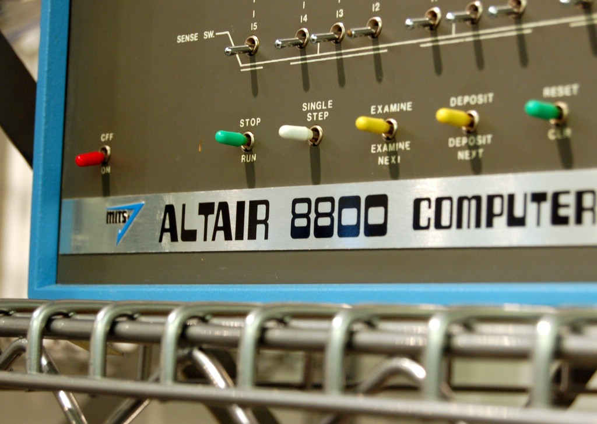

!SLIDE transition=fade background subsection
# History

!SLIDE transition=fade
# puppet master

!SLIDE transition=fade
# standalone - bash alias
## System puppet

!SLIDE transition=fade
# standalone - rump
## Bundler

!SLIDE transition=fade
# standalone - bash alias
## rbenv

